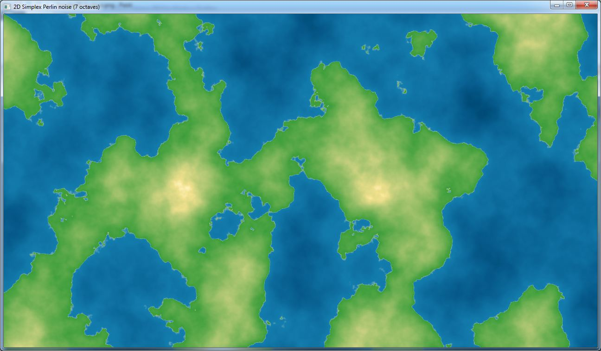
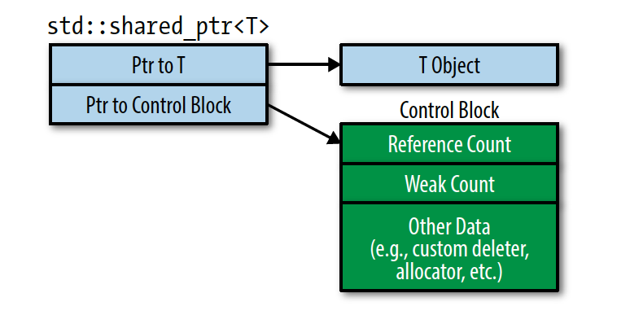

Hi, I am Sébastien Rombauts, or [SRombauts on Github](https://github.com/SRombauts).
I am a Senior Software Engineer working on developer tools, C++, C#, Unreal Engine and Unity, source control integrations, and AI-assisted software engineering.

See also my [developer blog](https://srombauts.eu) (with the source [portfolio](https://srombauts.eu/portfolio/)).

Connect on [LinkedIn](https://www.linkedin.com/in/srombauts/)
or follow me on [Twitter/X](https://twitter.com/SRombauts).

### Main GitHub repositories

- [SQLiteC++](http://srombauts.github.io/SQLiteCpp) ([repo](https://github.com/SRombauts/SQLiteCpp/)): a smart and easy to use C++ wrapper to the SQLite3 library.
- [UE Git Plugin](http://srombauts.github.io/UEGitPlugin) ([repo](https://github.com/SRombauts/UEGitPlugin/)): the official Unreal Engine Git Source Control Provider Plugin.
- [UE Plastic SCM Plugin](http://srombauts.github.io/UEPlasticPlugin) ([repo](https://github.com/SRombauts/UEPlasticPlugin/)): the official Unreal Engine Plastic SCM (Unity Version Control) Source Control Provider Plugin.

- [UE4 Architecture Vis](http://srombauts.github.io/UE4ArchVisDemo) ([repo](https://github.com/SRombauts/UE4ArchVisDemo)): run a live demo in the browser using HTML5/WebAssembly. 
*Click the image for the HTML5/WebAssembly live demo.*
- [UE4 Procedural Mesh](https://github.com/SRombauts/UE4ProceduralMesh): using the Unreal Engine 4 UProceduralMeshComponent.
- [UE4 Quick Start](https://github.com/SRombauts/UE4QuickStart): a mix of various Unreal Engine 4 C++ Tutorials.
- [LoggerC++](http://srombauts.github.io/LoggerCpp) ([repo](https://github.com/SRombauts/LoggerCpp/)): a simple, elegant and efficient C++ logger library.
- [HtmlBuilder](https://github.com/SRombauts/HtmlBuilder/): a simple C++ HTML DOM generator (used in a couple of embedded web services).
- [SimplexNoise](https://github.com/SRombauts/SimplexNoise/): a Perlin's Simplex Noise C++ implementation (1D, 2D, 3D).

- [shared_ptr](http://srombauts.github.io/shared_ptr) ([repo](https://github.com/SRombauts/shared_ptr/)): a minimal, light and fast shared_ptr implementation designed to handle cases where boost/std::shared_ptr are not available.

### AI-assisted software engineering

A prominent part of my recent work is about making AI coding agents useful on our big internal codebases: repository instructions ([`AGENTS.md`](https://github.com/SRombauts/srombauts.fr/blob/master/AGENTS.md) / `CLAUDE.md`), reusable skills, slash commands and MCP servers.
I learned and taught team members to treat the coding agent like a new hire that we have to onboard, and then review thoroughly and iterate on both the code AND the skills!

This blog ([source](https://github.com/SRombauts/srombauts.fr)) is a small example of that process: have a look at its [`AGENTS.md`](https://github.com/SRombauts/srombauts.fr/blob/master/AGENTS.md), which documents the repository instructions and the skills I rely on here, including the MIT-licensed `humanizer` skill I run on every post. A longer write-up series is in the works and will show up under the [ai tag](https://srombauts.eu/tags/).

For more advanced setups, see the following repositories:

- [SQLiteC++](https://github.com/SRombauts/SQLiteCpp): my long-running C++ library carries [a similar set of project skills](https://github.com/SRombauts/SQLiteCpp/tree/master/.claude/skills) for its builds, tests and releases.
- [pong-sdl3-cpp](https://github.com/SRombauts/pong-sdl3-cpp): an in-progress C++/SDL3 Pong I built mainly to exercise the process, with its own [`.claude/skills/`](https://github.com/SRombauts/pong-sdl3-cpp/tree/main/.claude/skills), a [roadmap](https://github.com/SRombauts/pong-sdl3-cpp/blob/main/docs/ROADMAP.md), CI and unit tests.

### Other experiments

Smaller things I have played with over the years: a Python [Entity Component System](https://github.com/SRombauts/ecs), [SDL](https://www.libsdl.org/) game prototypes, OpenGL including [gltext](https://github.com/SRombauts/gltext), [Ogre 3D](https://www.ogre3d.org/), and [ZeroMQ C++ bindings](https://github.com/SRombauts/ZMQCpp).

Sébastien Rombauts (sebastien.rombauts@gmail.com)
